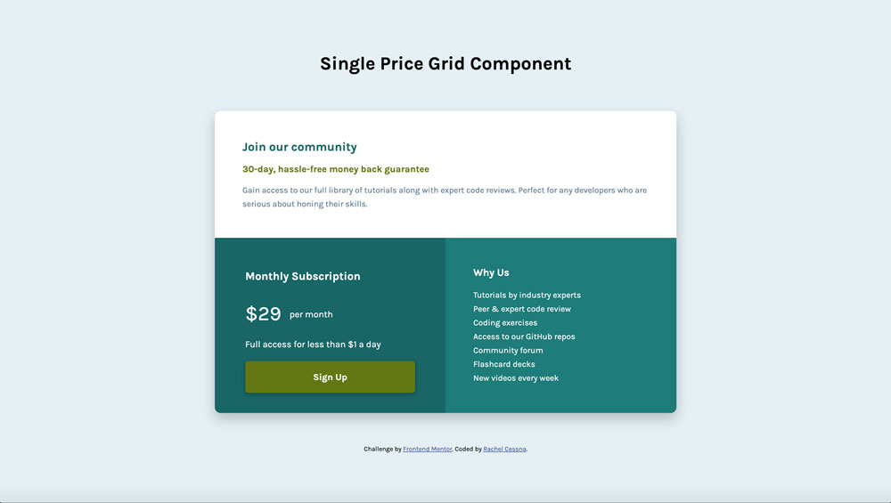

# Frontend Mentor - Single price grid component solution

This is a solution to the [Single price grid component challenge on Frontend Mentor](https://www.frontendmentor.io/challenges/single-price-grid-component-5ce41129d0ff452fec5abbbc). Frontend Mentor challenges help you improve your coding skills by building realistic projects. 

## Table of contents

- [Overview](#overview)
  - [The challenge](#the-challenge)
  - [Screenshot](#screenshot)
  - [Links](#links)
- [My process](#my-process)
  - [Built with](#built-with)
  - [What I learned](#what-i-learned)
  - [Accessibility Note](#accessibility-note)
  - [Useful resources](#useful-resources)
- [Author](#author)

## Overview

### The challenge

Users should be able to:

- View the optimal layout for the component depending on their device's screen size
- See a hover state on desktop for the Sign Up call-to-action

### Screenshot

#### Desktop Screenshot

#### Mobile Screenshot

### Links

- Solution URL: [GitHub Repo](https://github.com/cessnar516/FM-single-price-grid-component)
- Live Site URL: [GitHub Pages](https://cessnar516.github.io/FM-single-price-grid-component/)

## My process

### Built with

- Semantic HTML5 markup
- SASS
- Flexbox
- CSS Grid
- Mobile-first workflow

### What I learned

I used a combination of Flexbox and CSS Grid for this challenge. Flexbox is used to align the main content of the page in the center of the viewport, and CSS grid is used to align the sections of the main content when viewed on desktop-sized screens. I created explicit columns for the desktop layout, but I used implicit rows instead so they would be automatically sized to fit their content. Using implicit rows also allowed me to use less code. 

### Accessibility Note

The colors originally specified in the style guide for this challenge did not meet the minimum contrast requirements for WCAG AA compliance. Having sufficient contrast is important for users with low vision and/or color blindness to ensure they are able to read the information. Therefore, I adjusted the colors to meet WCAG AA contrast requirements. 

### Useful resources

- [A Complete Guide to Flexbox](https://css-tricks.com/snippets/css/a-guide-to-flexbox/) - This is a great resource for understanding flexbox, and it provides lots of code examples and illustrations.
- [A Complete Guide to CSS Grid](https://css-tricks.com/snippets/css/complete-guide-grid/) - This is another great resource from CSS Tricks that explains CSS Grid. 

## Author

- LinkedIn - [Rachel Cessna](https://www.linkedin.com/in/rachelacessna/)
- Frontend Mentor - [@cessnar516](https://www.frontendmentor.io/profile/cessnar516)
- CodePen - [@cessnar](https://codepen.io/cessnar)